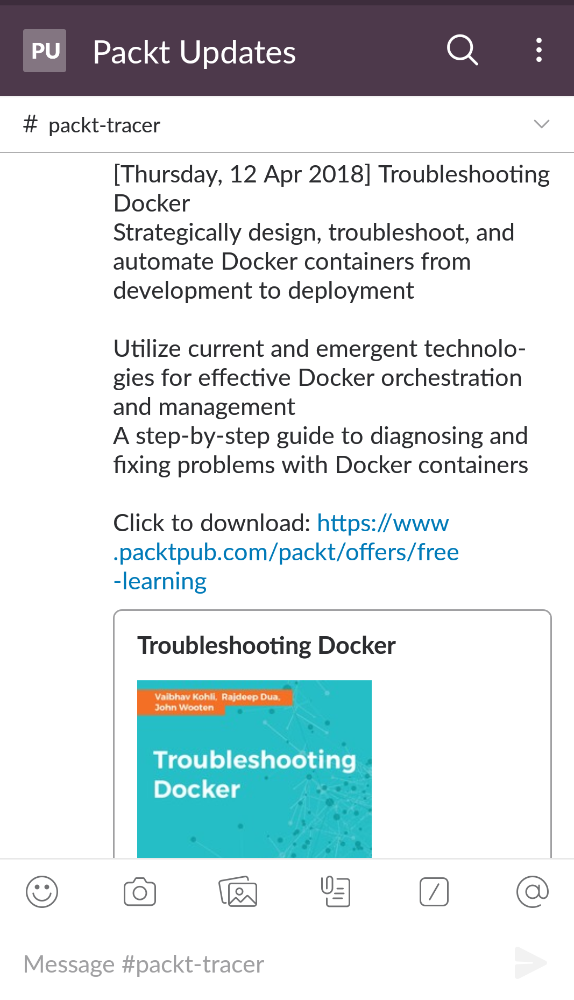

# Packt - Tracer

An automation.
[Packt](https://packtpub.com) offers a free ebook on Software Developement and the likes every day. While it's really amazing to have this offer, it is also incredibly painful to check their website every day to see if the book is something that would interest me.
Enter Packt-Tracer.

## What it does

It scarpes the webpage and extracts the following:
* Book Title
* Book Summary
* Book Image
* Link for download

The script then sends the above information to a Slack Channel using ```slackclient```

## Getting Started

To run the script, please follow the steps:
* Download the ZIP/ clone the project to your local machine.
* Install the following module - ```requests```, ```beautifulsoup4```, ```slackclient```.
* Get the API key for your Slack Worspace [here]( https://api.slack.com/docs/oauth-test-tokens).
[Read more about using ```slackclient``` for sending notification [here](https://medium.com/@harvitronix/using-python-slack-for-quick-and-easy-mobile-push-notifications-5e5ff2b80aad)]
* Enter the acquired token into the [key.py](key.py) file.
* Change the name of the channel in [packt-tracer.py](packt-tracer.py) as required.
* Run the script.

You should receive a notifiction on your Slack channel.

## Screenshots




